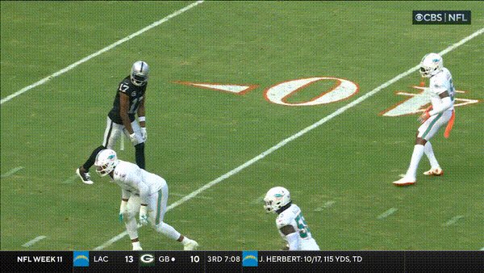
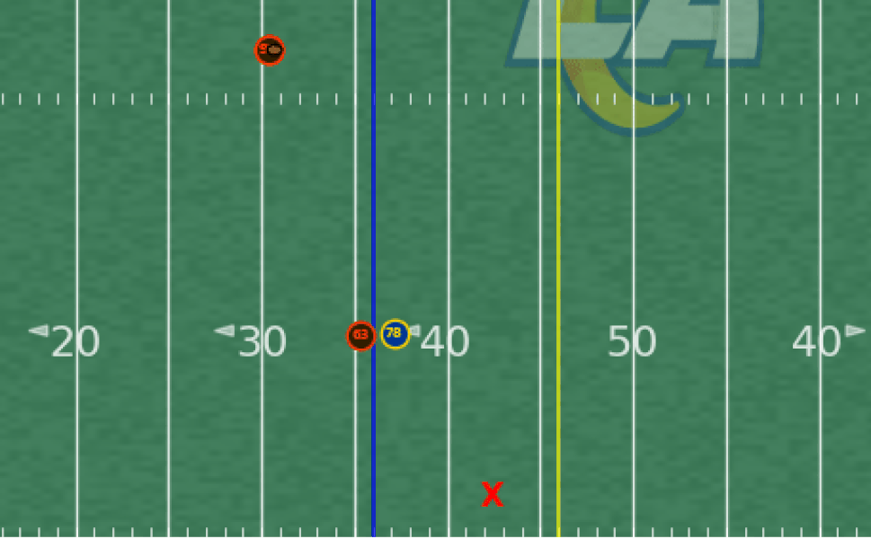
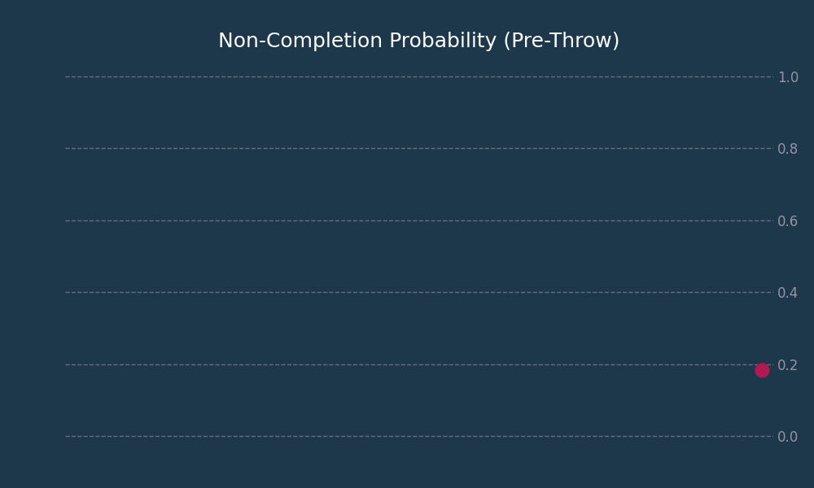
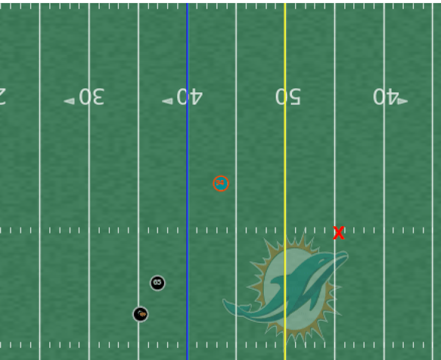
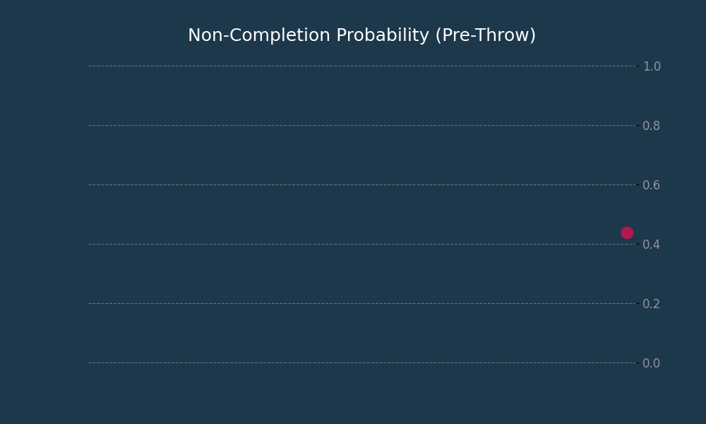
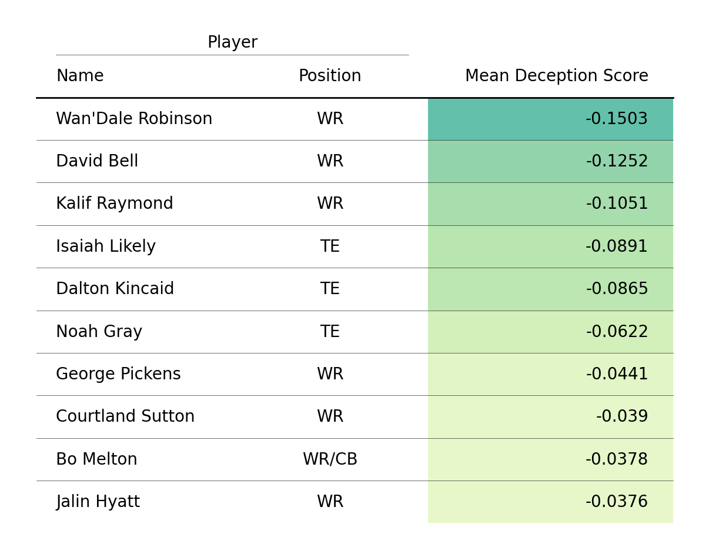
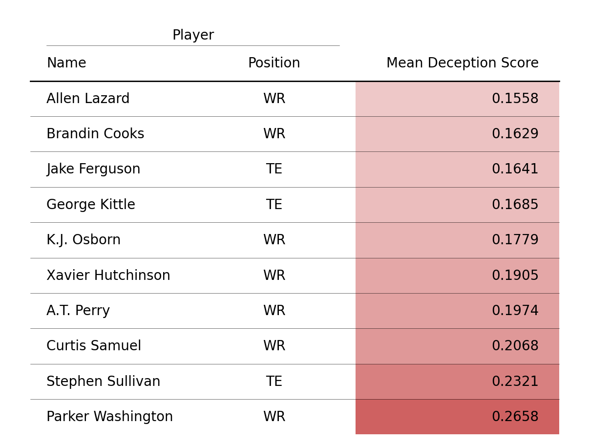
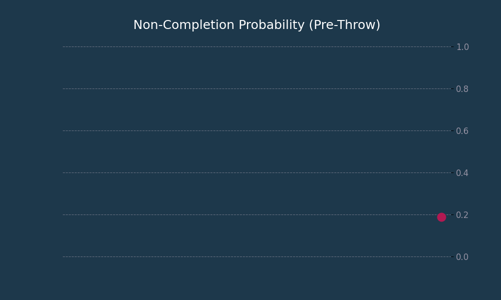
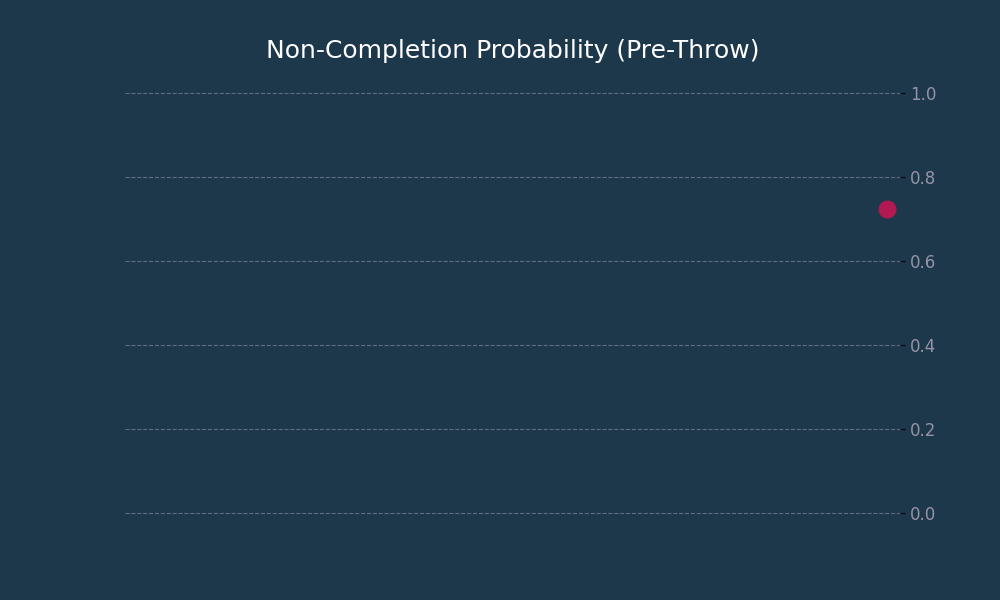
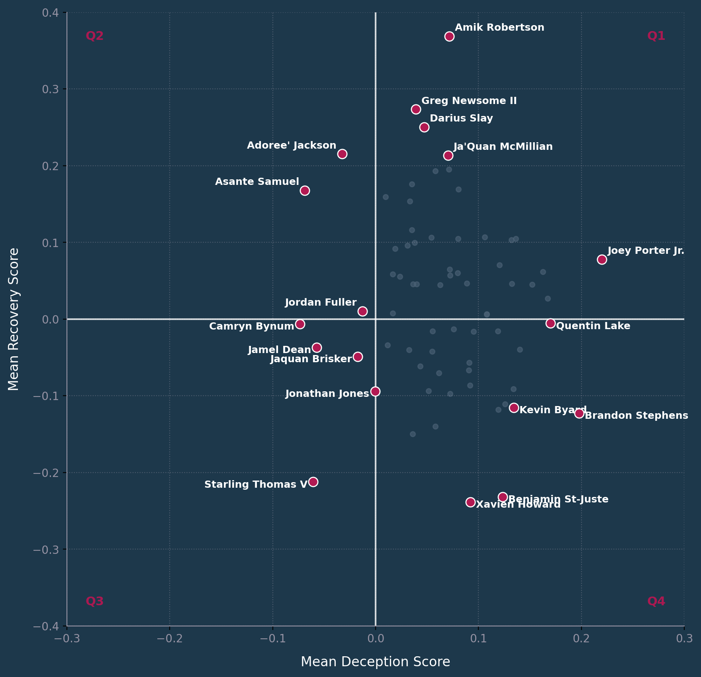

# Second Chances: Quantifying DBs' Post-Throw Recovery After Deceptive Routes

> *When it comes to playing cornerback, you're on an island out there. It doesn't matter if you’re hurt or you’re tired. (...) At the end of the day, the only thing that matters is... Can you make a play?"* - *Richard Sherman*

## Introduction

Richard Sherman’s question cuts to the core of the defensive back’s existence. In the modern NFL, where rules favor the offense and receivers run routes designed to break ankles, maintaining "perfect" coverage throughout the entire stem is nearly impossible. On sharp-breaking routes, receivers utilize rapid deceleration and deceptive body language to force the DB to freeze or "bite" on a fake.

In that split second, the receiver wins separation. **But the play isn't over**.

The difference between a completion and a game-changing turnover often lies not in the initial coverage but in the **recovery**. It is the ability to overcome a momentary disadvantage - a false step, a "bite", or a calculated bait - and close the distance while the ball is in flight.

Consider the play below (Figure 1).

At the moment A. O'Connell releases the ball, the analytics favor the offense. Tucker sells the vertical stem and breaks sharply inward. Ramsey appears to have lost the leverage required to make a play. A model looking at this freeze-frame would predict a high probability of completion.

However, Ramsey illustrates the concept of the **Second Chance**. Despite the low non-completion probability at the throw, he generates an interception

This submission investigates this specific phenomenon. We are not just looking at who sticks to receivers, we are quantifying the **resilience of defensive backs**. By analyzing player tracking data on routes defined by rapid directional changes (**In**, **Out**, and **Hitch**), this project aims to answer two questions:

1. **Pre-Throw:** Which DBs are most susceptible to false steps on deceptive routes?

2. **Post-Throw:** Which DBs possess the elite burst to close the gap after biting?

## Methodology

The core of our analysis is the decomposition of the defensive back's play into two quantifiable, sequential phases: **Deception** and **Recovery**. We first establish a baseline expectation of success for the defense using a Supervised Machine Learning Model that computes the **Non-Completion Probability ($P_{NC}$)** at each frame. This model is trained exclusively on data from the moment of the throw, ensuring $P_{NC}$ represents the true expected outcome given the final play setup. We then leverage the trained model in a time-series context to generate two novel metrics: tracking $P_{NC}$ evolution **pre-throw measures the receiver's deceptive success and the DB's initial failure** (or false step), and comparing the $P_{NC}$ at the throw with the actual play result **post-throw isolates the DB's recovery performance**.

### Data

We exclusively selected passes targeting a receiver running an **In**, **Out**, or **Hitch** route, as these patterns are defined by the sharp deceleration and rapid directional changes crucial to our hypothesis. We then filtered the tracking data to focus only on the **Targeted Receiver** and the **Closest Defender** (defined by the lowest separation in the final frame of the play), specifically filtering for plays where the closest defender was a **Defensive Back**. All plays were field-standardized to run left-to-right, and a relevancy filter was applied, keeping only targets where the **ball landed within 3 yards of either the receiver or the defender**, removing noisy data from significantly errant throws or throws where other players had direct impact.

From the resulting plays: the first nine weeks **(Weeks 1–9) were used for model training**, resulting in **1,941 training plays**, and the last nine weeks **(Weeks 10–18) were reserved for testing**, resulting in **1,902 testing plays**. The Supervised Machine Learning model used to compute the Non-Completion Probability ($P_{NC}$) was trained exclusively on data from the training set. **All reported results are generated entirely from the unseen testing data** to ensure our findings demonstrate genuine predictive power and generalizability.

### Model

Our Non-Completion Probability (PNC​) is computed using a **Gradient-Boosted Tree (GBT)** classifier (specifically, **XGBoost**), trained exclusively on play states captured at the moment of the throw. The feature set, which focuses on the kinematic and geometric state of the Targeted Receiver, Closest Defender, and Quarterback, was fine-tuned based on permutation importance analysis. **For complete details on the model architecture, feature engineering, and hyperparameter tuning, please refer to the accompanying [code repository](https://github.com/miguelmendesduarte/big-data-bowl-2026-analytics)**.

The final XGBoost model, optimized through grid search, demonstrated performance that is reliably better than chance and sufficiently calibrated for its analytical purpose on the unseen testing data (Weeks 10–18). The model achieved an **Area Under ROC Curve (AUC)** of **0.671**, a **Log Loss** of **0.581**, and a **Brier Score** of **0.194**.

### Deception Score

This score is a pre-throw metric designed to quantify the success of a receiver's route salesmanship in forcing the defender to commit a false step, or "bite".

A successful deception event is identified as a rapid, persistent change in the PNC​ time series pre-throw, specifically a drop that grants the receiver a sudden advantage. To identify this moment objectively, we utilize the **Pelt change-point detection algorithm** (L2 model) on the time series of PNC​ for each play.

1. **Change Point Identification**: The algorithm detects the single most significant change point in the PNC​ series, corresponding to the moment the defensive baseline expectation is most significantly altered.

2. **Score Calculation**: The Deception Score is then calculated as the **difference between the mean PNC**​ value in the segment **after** the change point (Spost​) and the mean PNC​ in the segment **before** the change point (Spre​):

This results in a **positive score** when the non-completion probability increases, meaning the **DB gained advantage**, and a **negative score** when the non-completion probability decreases, meaning the **DB lost advantage**.

### Recovery Score

The Recovery Score is our post-throw metric, isolating a defensive back's ability to "finish the play". It quantifies the final pass outcome against the model's expectation (PNC​ at the moment of the throw).

The score rewards the DB for successfully outperforming the expected PNC​ and penalizes them for underperforming. This metric is weighted to reflect the outcome's value: an **Incomplete pass** is rewarded with 1−PNC​, a **Completion** incurs a penalty of −PNC​, and an **Interception** earns the highest reward with a 1.2×(1−PNC​) multiplier. A higher (more positive) Recovery Score signifies a successful finish.

## Results

### Pre-Throw Phase: Deception and Initial Failure

#### Case Study 1: The Anatomy of a Bite

To validate the Deception Score, we first examine a prototypical "bite" involving receiver Elijah Moore (CLE) and cornerback Ahkello Witherspoon (LAR).

In this play (Figure 2), Moore accelerates vertically, prompting Witherspoon to respect the deep threat. As the defender commits hips to the vertical stem, the PNC​ climbs to a confident peak of 80%. However, Moore’s rapid deceleration and cut to the outside causes Witherspoon to overrun the break.

The impact is captured precisely by our model. The PNC​ plot plummets from 80% down to 20% in a split second. The Pelt algorithm correctly identifies this exact moment of directional change as the "break point", calculating a **Deception Score of -0.23**.

|  |  |
|:---------------------------------------------:|:-------------------------------------------------------------:|

Figure R1: (Great Fake) J.Flacco pass short right to E.Moore pushed ob at CLV 44 for 8 yards (A.Witherspoon).

#### Case Study 2: Quantifying Resilience

In contrast, we revisit the Jalen Ramsey interception introduced earlier (Figure 3) to illustrate a "failed" deception.

Early in the play, Ramsey respects Tre Tucker's pre-snap speed leverage, maintaining a cushion that yields a modest PNC​. As Tucker pushes vertically into "Ramsey Island", the specific dynamics of the route change. Unlike the Moore play—where the break caused a collapse in defensive probability-Ramsey’s break point marks a shift to tighter coverage.

Despite Tucker’s sharp IN cut, the Pelt algorithm identifies a phase shift where the mean **PNC​ actually increases** in the second segment relative to the first. The resulting **Deception Score of +0.25** confirms that Ramsey did not "bite"; instead, he statistically improved his leverage throughout the stem.

|  |  |
|:---------------------------------------------:|:-------------------------------------------------------------:|

Figure R2: (Bad Fake/Route) A.O'Connell pass deep middle intended for T.Tucker INTERCEPTED by J.Ramsey at MIA 44. J.Ramsey to MIA 47 for 3 yards (T.Tucker).

#### Dual Application: Evaluating Receiver Deception

While our primary focus is defensive performance, the Deception Score naturally serves as a powerful pre-throw evaluation of receiver route-running (Figure 4).

The analysis identifies **Wan'Dale Robinson** (Mean Deception Score: -0.1286) and **David Bell** (Mean Deception Score: -0.1058) as the league's most consistently deceptive players on In, Out, and Hitch routes. Crucially, this metric serves as a powerful leading indicator for sustained separation: Robinson and Kalif Raymond (Deception Score: -0.1052) didn't just rank highly - they finished #2 and #1 respectively in the entire NFL in PFF's 2023 [*Open-Target Rate*](https://www.pff.com/news/nfl-ranking-top-wide-receivers-open-target-rate-separation-2023), establishing a strong correlation between our metric's focus on the route break and the ability to achieve sustained separation. This suggests that the **quality of the initial fake is a key driver of final separation success**.

|  |  |
|:---------------------------------------------:|:-------------------------------------------------------------:|

Figure R3: WR Pre-Throw Deception Score Rankings.

Conversely, players with high positive scores, such as Parker Washington (+0.278), are statistically less effective at creating initial leverage. It is crucial to note that a **high positive score does not necessarily indicate a poor route runner**. It suggests these receivers rely less on early-stem deception or often execute their sharp route breaks later in the play (post-throw), thereby limiting the initial statistical advantage detectable by a pre-throw metric.

### Post-Throw Phase: Recovery and Play Finish

#### Case Study 1: The Statistical Anomaly

We first examine an interception by Donovan Wilson (DAL) against Sam LaPorta (DET) to illustrate an elite Recovery Score (Figure R4).

Pre-throw, LaPorta executes an Out route that gains leverage. As Goff releases the ball, the PNC​ has fallen to just 19%, meaning the model predicts a completion with 81% confidence. Statistically, the defense has already "lost" the rep. However, Wilson anticipates the break and jumps the route.

By converting a situation with low defensive expectation into the highest possible defensive outcome (Interception), Wilson generates a massive statistical surplus. This play yields a **Recovery Score of +0.98**.

|  |  |
|:---------------------------------------------:|:-------------------------------------------------------------:|

Figure R4: (Good recovery)

#### Case Study 2: The Squandered Advantage

Conversely, we examine a play involving Deonte Banks (NYG) covering Dontayvion Wicks (GB) on a long out route (Figure R5). Banks initially displays excellent coverage mechanics, closing the distance rapidly until the PNC​ peaks at a dominant 90%, signaling that the route is effectively "clamped".

However, just prior to the throw, Wicks executes a sharp outside cut while Banks loses his footing. Although the PNC​ drops to 72% at the moment of the throw, the model still heavily favors the defense. By allowing a completion from this statistically advantageous position, Banks incurs a severe penalty. The resulting **Recovery Score of -0.72** reflects the magnitude of the failure: a high-probability defensive win was converted into an offensive gain.

|  |  |
|:---------------------------------------------:|:-------------------------------------------------------------:|

Figure R5: (Bad recovery)

### Mapping Defensive Archetypes: The Deception-Recovery Plane

By plotting Mean Deception Score (x) against Mean Recovery Score (y), we generate a comprehensive map of defensive back performance profiles (Figure R6).

Figure R6: DB Quadrant (10+ plays).

While the majority of the league clusters in Quadrants 1 and 4 - indicating that most starting defensive backs possess at least strong pre-throw discipline - the outliers highlighted in our analysis reveal distinct strategic archetypes:

- **Quadrant 1**: These players combine pre-throw discipline with catch-point production. **Amik Robertson** emerges as a statistical standout in this sample, combining solid route recognition with elite ball skills to convert opportunities into stops. **Joey Porter Jr.** appears furthest right, identifying him as the league's most disciplined corner against fakes.

- **Quadrant 2**: High-variance athletes like **Asante Samuel** frequently "bite" on the break but rely on elite closing speed to "erase" the mistake and generate a positive outcome.

- **Quadrant 3**: This quadrant represents defenders who struggle in both phases. The analysis highlights **Starling Thomas V** as a distinct outlier, detached from the cluster. His positioning reflects significant statistical difficulty in both resisting the initial fake and recovering at the catch point on these specific routes.

- **Quadrant 4**: Technicians like **Xavien Howard** win the route early with superior positioning but are heavily penalized for "soft" finishes. Their negative Recovery Scores reveal a tendency to allow completions despite having a high statistical probability of success, effectively wasting their initial leverage.

## Conclusion

We present a framework decomposing coverage into Deception (discipline) and Recovery (finish). By tracking Non-Completion Probability, we isolate the exact moment leverage is lost and how defenders respond.

The model’s validity is confirmed by its ability to identify the NFL’s top route runners, correctly pinpointing Wan'Dale Robinson and Kalif Raymond as the [league's most deceptive receivers in 2023](https://www.pff.com/news/nfl-ranking-top-wide-receivers-open-target-rate-separation-2023). For defenses, this framework exposes critical market inefficiencies. It distinguishes between athletes who can survive a false step through elite recovery speed and "technicians" who win the route early but consistently squander that advantage at the catch point. This shifts evaluation from binary outcomes to precise diagnostics, allowing teams to scout and develop talent based on the specific phase - discipline or recovery.
